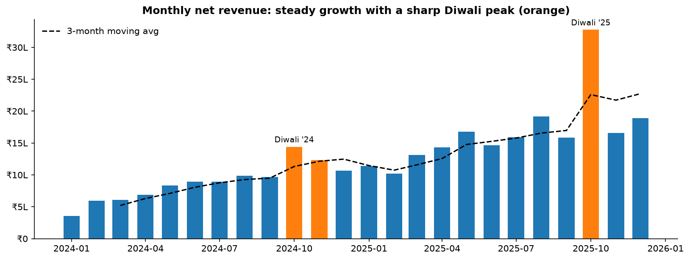
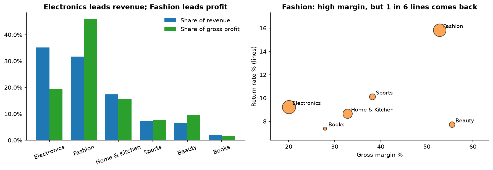
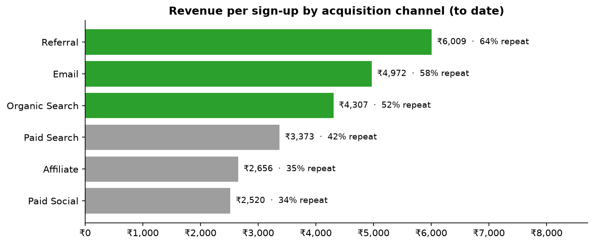
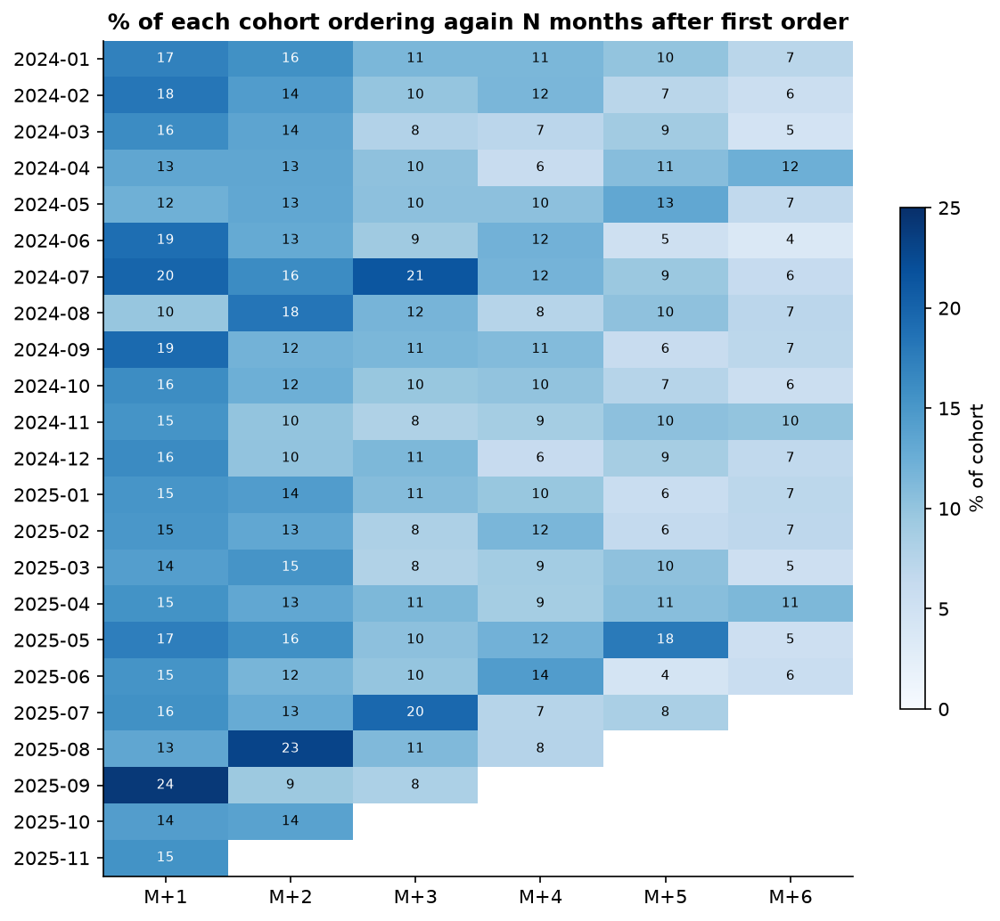
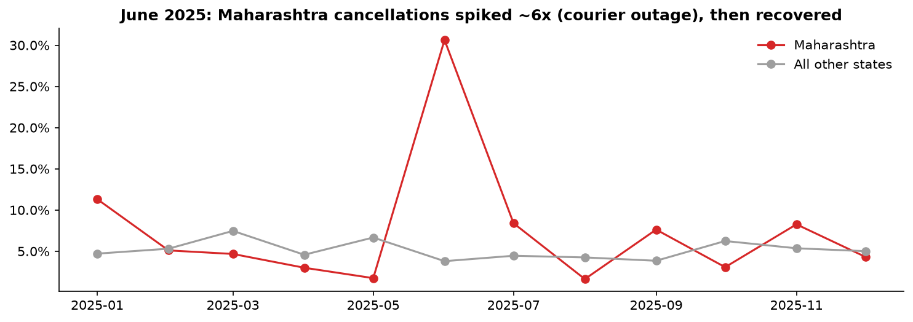
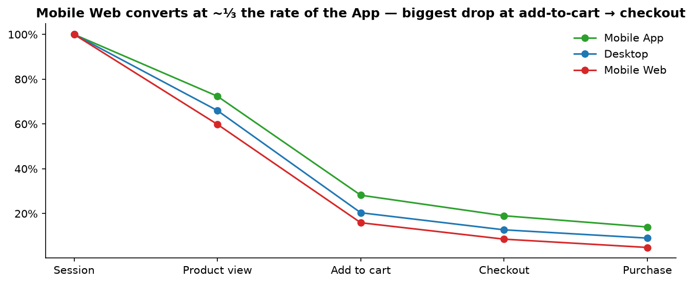
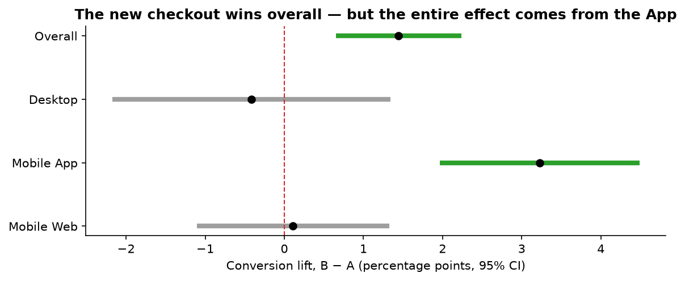

# ShopKart growth & revenue-leakage analysis

**An end-to-end data analyst portfolio project:** messy raw exports → a cleaning pipeline with a data-quality log →
SQL & pandas analysis → an A/B test readout → sized recommendations → a BI dashboard.

| | |
|---|---|
| **Business question** | What's driving growth, and where is ShopKart leaking revenue? |
| **Data** | 8,000 customers · 11,885 orders · 20,298 order lines · 40k web sessions · 24k-visitor A/B test (Jan 2024 – Dec 2025) |
| **Tools** | Python (pandas, matplotlib, SciPy) · SQL (SQLite) · Power BI / Tableau |
| **Deliverables** | [`analysis.ipynb`](analysis.ipynb) · [charts](figures/) · [dashboard kit](dashboard/) · this write-up |

> ShopKart is a fictional Indian e-commerce company. The data is synthetic but built to behave like real data,
> including duplicate rows, inconsistent labels, mixed date formats and unit errors in the raw exports.

---

## Executive summary

* **Revenue grew 89% to ₹2.0 Cr in 2025.** The growth is broad-based and not just Diwali: January–June revenue doubled (+102%). About a quarter of annual revenue lands in Oct–Nov.
* **Electronics brings the most revenue, Fashion brings the most profit.** Electronics is 35% of revenue but only 19% of gross profit (20% margin). Fashion is 32% of revenue and 46% of profit (53% margin), but 1 in 6 Fashion lines is returned.
* **Channel quality varies ~2.4x.** A Referral sign-up is worth ₹6,009 to date (64% of buyers repeat); a Paid Social sign-up is worth ₹2,520 (34% repeat).
* **Cash on Delivery orders are cancelled almost 3x as often** as prepaid ones (11.7% vs 4.0%).
* **An operational incident went unnoticed:** Maharashtra's cancellation rate hit 30.6% in June 2025, about 6x normal.
* **The new checkout should ship on the App.** It lifted conversion +1.45 pp overall (10.34% → 11.79%, p = 0.0004), and the lift comes entirely from the Mobile App (+3.2 pp).
* **Sized opportunity: ≈ ₹18 lakh a year (≈ 9% of 2025 revenue)** from three actions (see [Recommendations](#recommendations)).

---

## 1. Data cleaning

The raw exports had 14 kinds of issues. Each one was handled by a logged rule in [`src/cleaning.py`](src/cleaning.py), and
referential-integrity checks confirm nothing was broken along the way.

| Table | Issue | Rows | Action |
|---|---|---:|---|
| customers | Exact duplicates / near-duplicates with stray whitespace | 160 / 80 | Dropped / trimmed, kept first |
| customers | City variants (`Bangalore`, `NEW DELHI`, `Bombay`…) | 1,160 | Mapped to official names |
| customers | `signup_date` in 3 formats (`2024-03-05`, `05/03/2024`, `05 Mar 2024`) | 2,365 | Parsed each format explicitly (day-first) |
| orders | Status casing / trailing spaces | 2,954 | Trim + Title Case |
| orders | Payment variants (`COD`, `upi`, `CC`…) | 2,300 | Mapped to 5 canonical values |
| order_items | Negative quantities | 40 | Absolute value |
| order_items | Prices 100x too high (entered in paise) | 15 | ÷ 100 (rule: > 10x list price) |
| order_items | Missing unit price | 25 | Product median price |

**Validation:** the cleaned data reconciles to the source system's clean extract within ₹445 (0.002%) on
₹1.99 Cr of 2025 revenue. The gap comes from the 25 imputed prices.

## 2. Growth



| KPI | 2024 | 2025 | YoY |
|---|---:|---:|---:|
| Net revenue | ₹1.06 Cr | ₹2.00 Cr | **+88.8%** |
| Valid orders | 3,584 | 6,541 | +82.5% |
| AOV | ₹2,950 | ₹3,052 | +3.5% |
| Buying customers | 2,252 | 4,033 | +79.1% |
| Gross margin | 34.4% | 37.5% | +3.1 pp |
| Return rate | 8.9% | 9.5% | +0.6 pp |

Growth is **volume-driven** (more customers, more orders). AOV and margin rose modestly after the April 2025 price revision.

## 3. Profitability by category



Electronics tops the revenue ranking but has the thinnest margin. Fashion is the profit engine, but ₹18 lakh of
Fashion orders came back as returns over the two years.

## 4. Customers & retention





On average 16% of a cohort orders again in the month after their first purchase, 11% at month 3 and 7% at month 6.
Retention is fairly stable across cohorts, so growth is coming from acquisition rather than from better retention.
That makes channel mix a real lever.

## 5. Where revenue leaks





* **COD:** 11.7% cancellation rate vs 4.0% for prepaid. That's ~179 excess cancelled orders (≈ ₹5.3 lakh GMV) over two years.
* **Incident:** Maharashtra, June 2025: 30.6% of 111 orders cancelled; the rate went back to normal in July.
* **Mobile Web funnel:** 4.9% of sessions purchase vs 14.0% in the App. The biggest gap is cart → checkout (54% vs 68%).

## 6. Experiment: new checkout

Pre-registered primary metric: conversion; guardrail: revenue per visitor; two-sided z-test, α = 0.05.
The sample-ratio check passed (12,006 vs 11,994, p = 0.94).



| Segment | Control | New checkout | Lift | 95% CI | p |
|---|---:|---:|---:|---|---:|
| **Overall** | 10.34% | 11.79% | **+1.45 pp** | +0.65 to +2.24 pp | 0.0004 |
| Mobile App | 11.34% | 14.57% | +3.23 pp | significant | < 0.0001 |
| Mobile Web | 8.88% | 8.99% | +0.11 pp | spans 0 | 0.86 |
| Desktop | 10.74% | 10.32% | −0.42 pp | spans 0 | 0.64 |

Revenue per visitor also rose (₹149 → ₹164, p = 0.03), so the guardrail held. **Caveat:** the device split was
not pre-registered, so the App-only effect is a hypothesis to confirm with a follow-up test, not a conclusion.

## Recommendations

| # | Action | Est. annual impact | Key assumption |
|---|---|---:|---|
| 1 | Ship the new checkout on the **Mobile App**; redesign and re-test on Web | **≈ ₹14.4 L** | Observed App lift, halved for novelty / regression to the mean |
| 2 | Nudge COD → prepaid (UPI cashback, COD confirmation OTP) | ≈ ₹1.3 L | Halve the excess COD cancellations |
| 3 | Fashion size guides + fit reviews | ≈ ₹2.3 L | Return rate −3 pp |
| 4 | Shift acquisition budget toward Referral / Email | not sized | Needs CAC by channel (spend data) |
| 5 | Daily alert on state cancel rate > 2x baseline | risk reduction | Would have caught June 2025 within days |
| 6 | Plan Diwali inventory & staffing (peak month ≈ 1.9x a normal month) | risk reduction | |

**Limitations:** no marketing-spend data, so no CAC or ROI; web sessions and experiment visitors aren't linked to
orders; 2025 cohorts have short observation windows.

---

## Reproduce

```bash
pip install -r requirements.txt                               # from the repo root
python data/generate_data.py                                  # (re)build the data
python portfolio/shopkart-growth-analysis/build_notebook.py   # execute notebook + export charts
python portfolio/shopkart-growth-analysis/dashboard/build_star_schema.py
```

## Make it yours (important!)

Recruiters see a lot of copied projects, so change this one before you show it:

1. **Re-run with your own twist.** Add a question (e.g. *"Which products drive repeat purchases?"*) or build the dashboard yourself in Power BI or Tableau.
2. **Or swap in real data.** The same notebook structure works on public datasets such as *Olist Brazilian E-Commerce* (Kaggle), *Online Retail II* (UCI) or *Maven Analytics* challenge datasets.
3. **Write the summary in your own words** and be ready to defend every number: why median-impute prices? Why halve the A/B lift?

### Resume bullets (adapt the wording)

* Cleaned and validated 40k+ rows across 4 source tables (14 logged data-quality rules + 3 integrity checks, reconciled to within 0.002%), then analysed 2 years of e-commerce data with **SQL and pandas**.
* Found that Fashion produced **46% of gross profit on 32% of revenue** despite a 16% return rate, and sized a ₹2.3 L/yr returns-reduction opportunity.
* Analysed a **24k-visitor A/B test** (z-test, 95% CI, SRM check): recommended an App-only rollout worth an estimated **₹14 L/yr** and a follow-up test for web.
* Built a star-schema **Power BI** dashboard (15+ DAX measures including YoY and cohort retention) that surfaces a regional logistics incident (6x normal cancellations) within a single drill-down.
