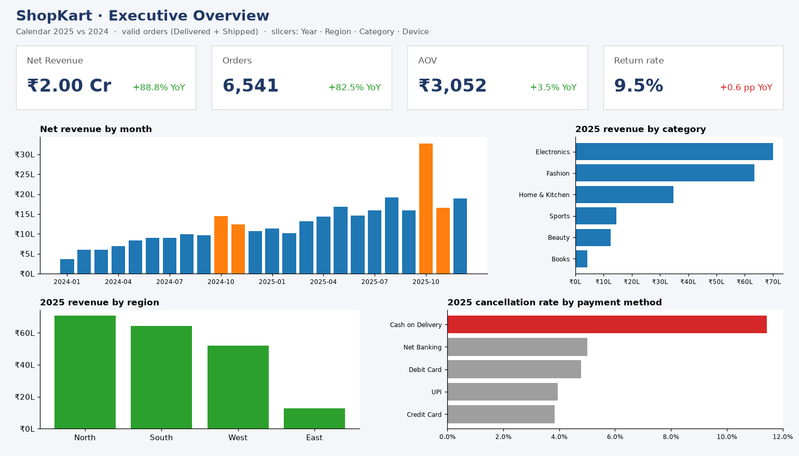

# Build the ShopKart dashboard in Power BI or Tableau



*The picture above is a static mock-up (made with matplotlib) of the page you'll build. Your goal is to
recreate it interactively, then add the two extra pages below.*

## 1. The data model (star schema)

`model/` holds four CSVs, created by `build_star_schema.py`:

```
                 dim_date (date_key)
                        │ 1
                        │
dim_customer ──1───*  fact_sales  *───1── dim_product
(customer_id)     (grain: 1 row per      (product_id)
                   order line)
```

| Table | Grain / key | Notable columns |
|---|---|---|
| `fact_sales` | `order_item_id` (20,298 rows) | `net_revenue`, `cogs`, `discount`, `quantity`, `status`, `is_valid` (1 = Delivered/Shipped), `is_first_order`, `device`, `payment_method` |
| `dim_customer` | `customer_id` | city, state, region, acquisition_channel, age_band, cohort_month |
| `dim_product` | `product_id` | product_name, category, subcategory, list_price, unit_cost |
| `dim_date` | `date_key` (yyyymmdd) | date, year, quarter, year_month, weekday, **fiscal_year** (Indian FY, Apr–Mar), is_festive_season |

**Why a star schema?** Filters flow from the dimensions into the fact table in one direction. That keeps
measures simple, avoids ambiguous paths, and is exactly what interviewers expect you to explain.

## 2. Power BI: step by step

1. **Get Data ▸ Text/CSV**, load all four files. In Power Query, check the types: `date` = Date, money columns = Decimal, keys = Whole Number.
2. **Model view:** drag `dim_date[date_key]` → `fact_sales[date_key]`, `dim_customer[customer_id]` → `fact_sales[customer_id]`, `dim_product[product_id]` → `fact_sales[product_id]`. All many-to-one, single direction.
3. Select `dim_date` ▸ **Mark as date table** (column `date`), then sort `month_name` by `month_num`.
4. Create a blank `_Measures` table and add the measures below.
5. Build the pages (section 4). Add **slicers** for Year, Region, Category and Device, and use **Sync slicers** across pages.

### DAX measures

```DAX
Net Revenue =
CALCULATE ( SUM ( fact_sales[net_revenue] ), fact_sales[is_valid] = 1 )

Orders =
CALCULATE ( DISTINCTCOUNT ( fact_sales[order_id] ), fact_sales[is_valid] = 1 )

AOV = DIVIDE ( [Net Revenue], [Orders] )

Gross Profit =
CALCULATE ( SUM ( fact_sales[net_revenue] ) - SUM ( fact_sales[cogs] ), fact_sales[is_valid] = 1 )

Gross Margin % = DIVIDE ( [Gross Profit], [Net Revenue] )

All Orders = DISTINCTCOUNT ( fact_sales[order_id] )

Return Rate % =
DIVIDE ( CALCULATE ( [All Orders], fact_sales[status] = "Returned" ), [All Orders] )

Cancel Rate % =
DIVIDE ( CALCULATE ( [All Orders], fact_sales[status] = "Cancelled" ), [All Orders] )

Buying Customers =
CALCULATE ( DISTINCTCOUNT ( fact_sales[customer_id] ), fact_sales[is_valid] = 1 )

New Customer Revenue =
CALCULATE ( [Net Revenue], fact_sales[is_first_order] = 1 )

-- Time intelligence (needs the marked date table)
Net Revenue PY = CALCULATE ( [Net Revenue], SAMEPERIODLASTYEAR ( dim_date[date] ) )

Revenue YoY % = DIVIDE ( [Net Revenue] - [Net Revenue PY], [Net Revenue PY] )

Revenue MTD = TOTALMTD ( [Net Revenue], dim_date[date] )

Revenue FYTD = TOTALYTD ( [Net Revenue], dim_date[date], "3/31" )   -- Indian FY ends 31 Mar

Revenue 3M Avg =            -- average of the last 3 MONTHLY totals
VAR Period = DATESINPERIOD ( dim_date[date], MAX ( dim_date[date] ), -3, MONTH )
RETURN
    CALCULATE ( AVERAGEX ( VALUES ( dim_date[year_month] ), [Net Revenue] ), Period )

Revenue Share of Total =
DIVIDE ( [Net Revenue], CALCULATE ( [Net Revenue], ALLSELECTED ( dim_product[category] ) ) )

Category Rank =
RANKX ( ALL ( dim_product[category] ), [Net Revenue], , DESC, DENSE )
```

**Checking your numbers:** with Year = 2025 and no other filters you should see Net Revenue **₹1,99,60,774.65**,
Orders **6,541**, AOV **₹3,051.64** and Return Rate **9.47%**. These match the SQL practice set, which uses the same
clean data. (The portfolio notebook shows ₹1,99,61,219.65. It rebuilds the data from the *raw* exports and imputes 25
missing prices with medians, so it's ₹445 higher. Reconciling a gap like this is a great interview story.)

## 3. Tableau: the same logic

Connect to the four CSVs and relate them on the keys (Tableau "relationships", not joins). Calculated fields:

| Field | Formula |
|---|---|
| Net Revenue | `SUM(IF [Is Valid] = 1 THEN [Net Revenue] END)` |
| Orders | `COUNTD(IF [Is Valid] = 1 THEN [Order Id] END)` |
| AOV | `[Net Revenue (calc)] / [Orders]` |
| Gross Margin % | `SUM(IF [Is Valid]=1 THEN [Net Revenue]-[Cogs] END) / [Net Revenue (calc)]` |
| Return Rate % | `COUNTD(IF [Status]="Returned" THEN [Order Id] END) / COUNTD([Order Id])` |
| Revenue YoY % | Table calculation: *Percent Difference From ▸ Previous*, along Year (or `(ZN(SUM(...)) - LOOKUP(ZN(SUM(...)), -1)) / ABS(LOOKUP(ZN(SUM(...)), -1))`) |
| First purchase date (LOD) | `{ FIXED [Customer Id] : MIN([Date]) }` |
| Cohort month | `DATETRUNC('month', [First purchase date])` |
| Months since first order | `DATEDIFF('month', [Cohort month], DATETRUNC('month', [Date]))` |
| Top-N parameter filter | `RANK(SUM([Net Revenue])) <= [Top N]` |

## 4. Pages to build

**Page 1: Executive Overview** (the mock-up)
* KPI cards: Net Revenue, Orders, AOV, Return Rate %, each with YoY vs PY (conditional colour: green good / red bad)
* Column chart: Net Revenue by `year_month`, festive months highlighted (colour by `is_festive_season`)
* Bar: revenue by category · Bar: revenue by region · Bar: cancel rate by payment method

**Page 2: Customers & Retention**
* Matrix/heatmap: `cohort_month` × months-since-first-order, value = distinct customers ÷ cohort size (conditional formatting)
* Bar: revenue per customer and repeat rate by `acquisition_channel`
* Line: New vs Returning revenue by month (`is_first_order`)

**Page 3: Operations**
* Map or filled bar: cancel rate by state (drill to month → spot Maharashtra, June 2025)
* Scatter: category margin % vs return rate %, bubble size = revenue
* Tooltip page showing the top 5 products for the hovered category

**Design checklist:** one message per visual (put the insight in the title) · consistent number formats (₹ lakh/crore) ·
max ~6 visuals per page · slicers top or left · no 3-D or pie charts with more than 3 slices · alt text on visuals.

## 5. Publish it

* **Tableau Public** is free: publish and link it on your resume/LinkedIn.
* **Power BI:** *Publish to web* needs a work account; otherwise save the `.pbix` to GitHub plus screenshots / a GIF walkthrough.
